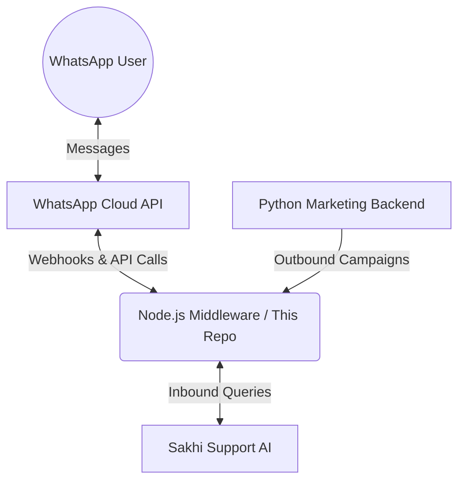

# WhatsApp Chatbot Middleware

## Core Purpose
This repository serves as the **central communication hub** (Middleware) for the WhatsApp Chatbot ecosystem. Its primary goal is to **bridge the gap** between Meta's WhatsApp Cloud API and our internal business services (Support AI and Marketing Backend).

It abstracts away the complexity of the raw WhatsApp API, handling webhook verification, message parsing, and response formatting, creating a uniform interface for our other services.

## Architecture Overview

High-level data flow:

## How It Works (Abstract)

1.  **Inbound Flow (Customer Support)**
    *   **Listen**: We expose a webhook (`POST /webhook`) that Meta notifies whenever a user sends a message.
    *   **Process**: We parse the raw JSON from Meta, extracting the sender's number and text.
    *   **Forward**: The clean message is sent to the **Sakhi Support AI**.
    *   **Reply**: When the AI responds, this middleware formats the text (handling generic text, buttons, or lists) and sends it back to the user via WhatsApp.

2.  **Outbound Flow (Marketing System)**
    *   **Trigger**: The **Python Backend** (Campaign Manager) decides to send a message to a user.
    *   **Request**: It calls our internal endpoint (`POST /v1/send-message`) with the target phone number and message content.
    *   **Deliver**: This middleware handles the authentication with Meta and delivers the message to the user/WhatsApp.

## Key Technologies
*   **Runtime**: Node.js
*   **Framework**: Express.js
*   **External Integration**: Axios (for HTTP requests to Meta and AI services)
